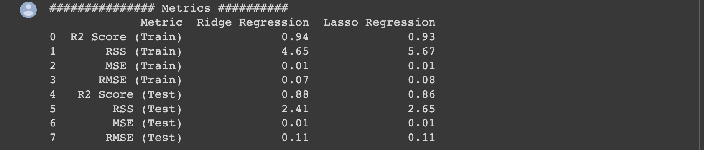

# Project Name

> Surprise Housing Case Study

## Table of Contents

- [Project Name](#project-name)
  - [Table of Contents](#table-of-contents)
  - [General Information](#general-information)
  - [Conclusions](#conclusions)
    - [Ridge Regression](#ridge-regression)
    - [Lasso Regression](#lasso-regression)
    - [General observations](#general-observations)
  - [Technologies Used](#technologies-used)
  - [Acknowledgements](#acknowledgements)
  - [Contact](#contact)
  - [Local setup of repository with vscode](#local-setup-of-repository-with-vscode)

## General Information

- A US-based housing company named Surprise Housing has decided to enter the Australian market. The company uses data analytics to purchase houses at a price below their actual values and flip them on at a higher price,
- Build a regression model using regularisation in order to predict the actual value of the prospective properties and decide whether to invest in them or not.

## Conclusions

### Ridge Regression

- The optimum value for alpha is 10
- The important predictors are
  - Neighborhood_Crawfor   0.08
  - YearBuilt              0.06
  - GrLivArea              0.06
  - Condition1_Norm        0.06
  - OverallQual            0.05
  - Neighborhood_Somerst   0.05
  - Neighborhood_BrkSide   0.05
  - Functional_Typ         0.04
  - Exterior1st_BrkFace    0.04
  - 2ndFlrSF               0.04

### Lasso Regression

- The optimum value for alpha is 0.001
- The important predictors are
  - GrLivArea              0.10
  - Neighborhood_Crawfor   0.08
  - YearBuilt              0.07
  - OverallQual            0.06
  - Neighborhood_Somerst   0.06
  - Condition1_Norm        0.05
  - Neighborhood_BrkSide   0.05
  - Exterior1st_BrkFace    0.04
  - OverallCond            0.04
  - TotalBsmtSF            0.04

- Lasso selects 57 predictor features out of 232 features

### General observations

Comparing Ridge and Lasso Model

## Technologies Used

- jupyter - version 1.0.0
- pandas - version 1.3.5
- matplotlib - version 3.5.3
- seaborn - version 0.12.0
- numpy - version 1.21.6
<!-- As the libraries versions keep on changing, it is recommended to mention the version of library used in this project -->

## Acknowledgements

## Contact

Created by [Kishore](https://github.com/kishore-n-george) - feel free to contact me!

## Local setup of repository with vscode

- Create a virtual env by running `python -m venv .venv`
- Activate the venv by running `source ./.venv/bin/activate`
- Install the dependencies by running `pip3 install -r requirements.txt`
- Run the following commnads to make jupyter notebook use the venv `pip3 install ipykernel`
- `python3 -m ipykernel install --user --name=lending-club`
- Restart vscode.
